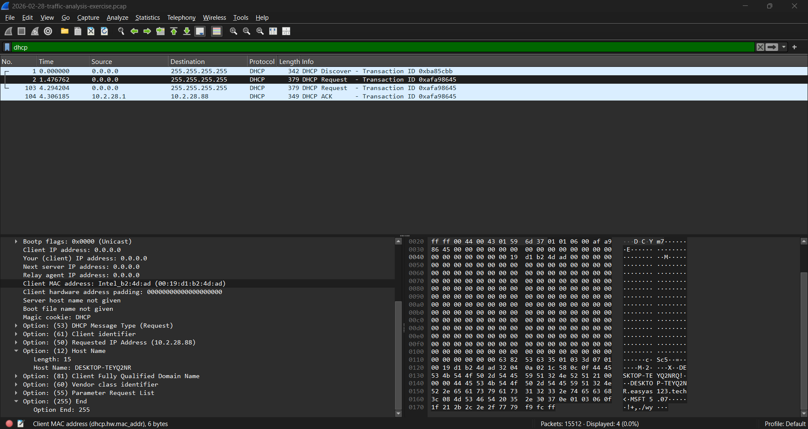
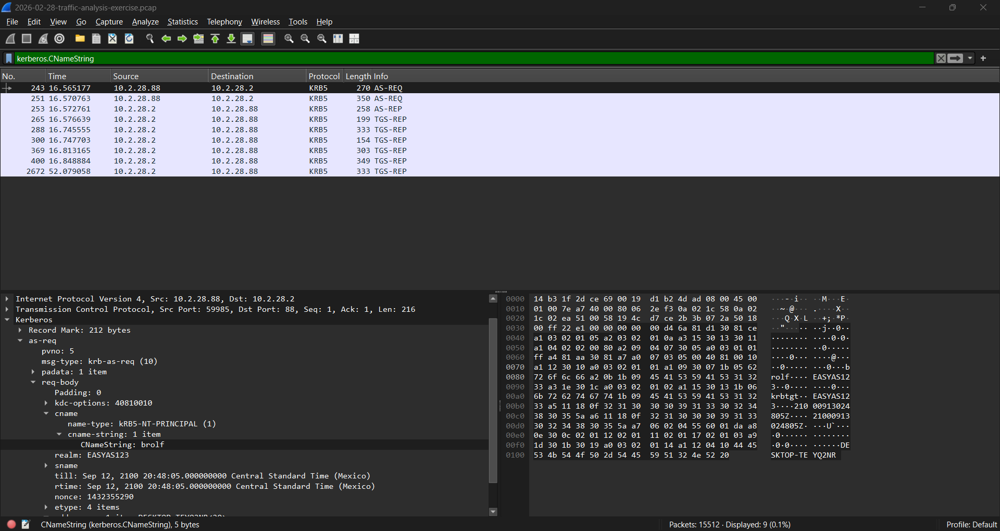
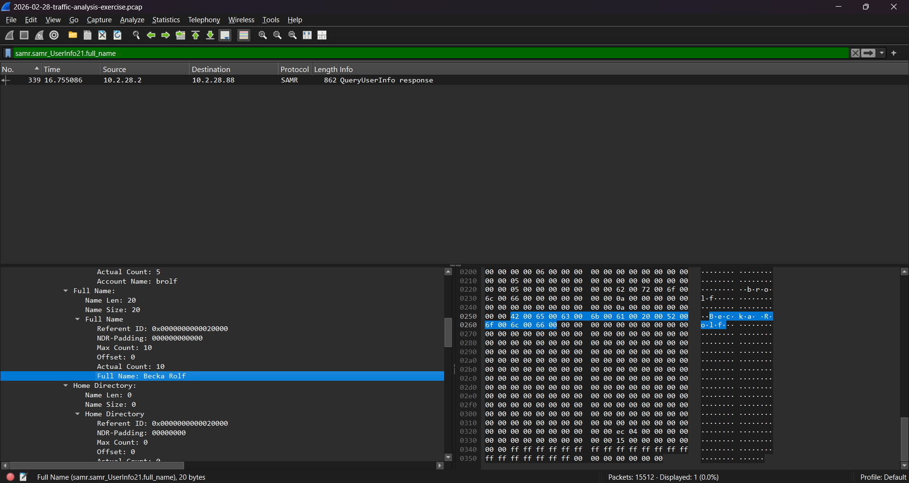

# Network Traffic Analysis, NetSupport RAT

A SIEM alert indicates that a computer on the network is communicating with a malicious IP. Wireshark tells us exactly which machine it is, how to identify it physically, and who it belongs to.

## Overview

| Field | Detail |
| :--- | :--- |
| **Alert Type** | Active infection by NetSupport RAT. |
| **Infected Host** | DESKTOP-TEYQ2NR, 10.2.28.88, 00:19:d1:b2:4d:ad |
| **User Account** | brolf (Becka Rolf) |
| **Outcome** | Host identified by MAC and username. Set of IOCs produced for isolation. |

## What Happened

A computer on the corporate network was infected with a Remote Access Trojan (RAT). Knowing only the malicious destination IP from the SIEM alert, the goal of this analysis was to investigate the traffic capture to discover the critical information of the infected computer: its local IP address, MAC address, hostname, username, and the real name of the affected person.

## Host Identification via DHCP

First, it was necessary to find which local IP was communicating with the attacker's IP. To isolate this traffic over the HTTPS port, the following filter was used:

`ip.addr == 45.131.214.85 && tcp.port == 443`

This confirmed that the infected internal IP was `10.2.28.88`. However, since an IP can change, hardware information was required to locate the computer. The `dhcp` filter was applied to analyze the network requests. By reviewing a `DHCP Request` packet sent by that IP, the MAC address and the Hostname were found inside the options of the same packet.

## User Identification via Kerberos and SAMR

To determine the compromised Active Directory account, the authentication traffic to the Domain Controller was analyzed using the `kerberos.CNameString` filter. When reviewing the first `AS-REQ` packet on the list, the `CNameString` field revealed that the active account was `brolf`.

Finally, to find the person's full name and bypass Windows text encoding issues, the SAMR protocol was used with the `samr.samr_UserInfo21.full_name` filter. The result was a single packet that, when analyzed, contained the structure with the user's real name.

## IOC Table

| Type | Value | Verdict |
| :--- | :--- | :--- |
| **C2 IP** | `45.131.214.85` | Malicious, NetSupport RAT C2 |
| **Infected Host IP** | `10.2.28.88` | Compromised computer |
| **MAC Address** | `00:19:d1:b2:4d:ad` | Hardware identifier |
| **Hostname** | `DESKTOP-TEYQ2NR` | Name of the computer to isolate |
| **User Account** | `brolf` | Compromised credentials |
| **Full Name** | `Becka Rolf` | Computer operator |

## Recommended Response

Based on the confirmation of an active remote control (RAT) infection, the Technical Support team is recommended to proceed with the following actions:

1. **Isolate the computer:** Immediately disconnect the machine `DESKTOP-TEYQ2NR` from the network (cable and Wi-Fi) using its MAC address (`00:19:d1:b2:4d:ad`) to ensure the isolation survives a DHCP IP change.
2. **Protect the identity:** Force a password change and revoke the active sessions of Becka Rolf's account (`brolf`).
3. **Endpoint cleanup:** Submit the computer for reinstallation or forensic analysis to remove the malware's persistence.
